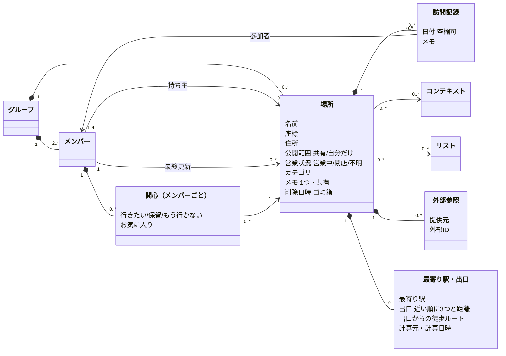

# データモデル

状態: 初版（2026-10-26）
判断記録: [0010](../decisions/0010-data-model.md)

```mermaid
classDiagram
  direction LR
  class Group["グループ"]
  class Member["メンバー"]
  class Place["場所"] {
    名前
    座標
    住所
    公開範囲 共有/自分だけ
    営業状況 営業中/閉店/不明
    カテゴリ
    メモ 1つ・共有
    削除日時 ゴミ箱
  }
  class Interest["関心（メンバーごと）"] {
    行きたい/保留/もう行かない
    お気に入り
  }
  class Visit["訪問記録"] {
    日付 空欄可
    メモ
  }
  class Context["コンテキスト"]
  class List["リスト"]
  class ExternalRef["外部参照"] {
    提供元
    外部ID
  }
  class Access["最寄り駅・出口"] {
    最寄り駅
    出口 近い順に3つと距離
    出口からの徒歩ルート
    計算元・計算日時
  }
  Group "1" *-- "2..*" Member
  Group "1" *-- "0..*" Place
  Member "1" --> "0..*" Place : 持ち主
  Member "1" --> "0..*" Place : 最終更新
  Member "1" *-- "0..*" Interest
  Interest "0..*" --> "1" Place
  Place "1" *-- "0..*" Visit
  Visit "0..*" --> "1..*" Member : 参加者
  Place "0..*" --> "0..*" Context
  Place "0..*" --> "0..*" List
  Place "1" *-- "0..*" ExternalRef
  Place "1" *-- "0..1" Access
```

- 「行った」は、そのメンバーが参加者に入っている訪問記録が1件以上あるかで決まる
- 共有の場所を外すと、持ち主だけの場所に戻る
